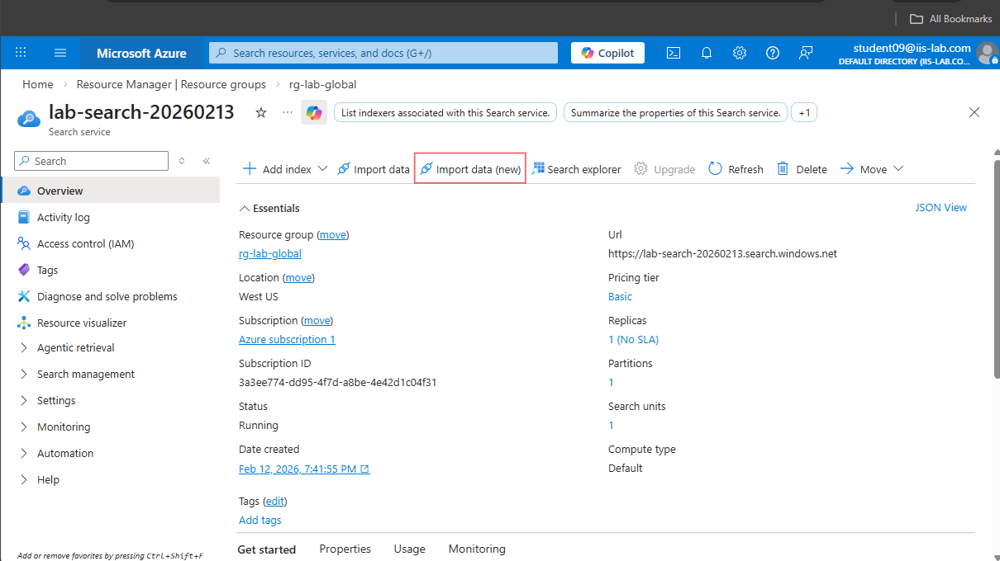
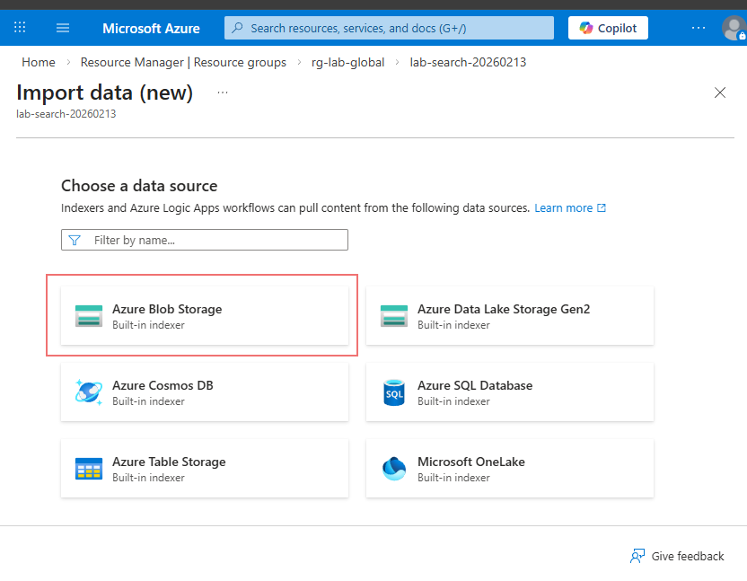
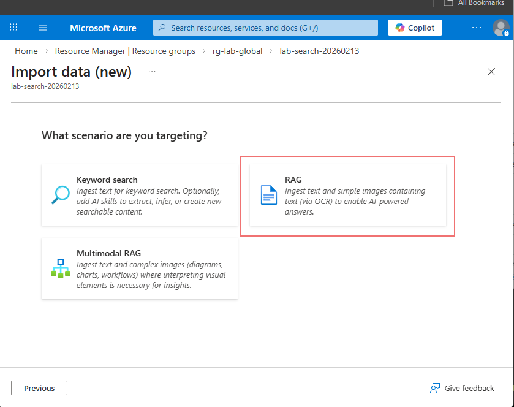
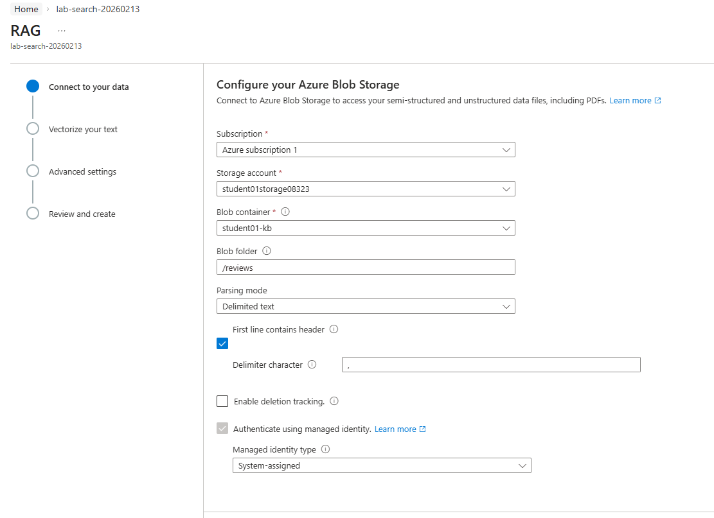
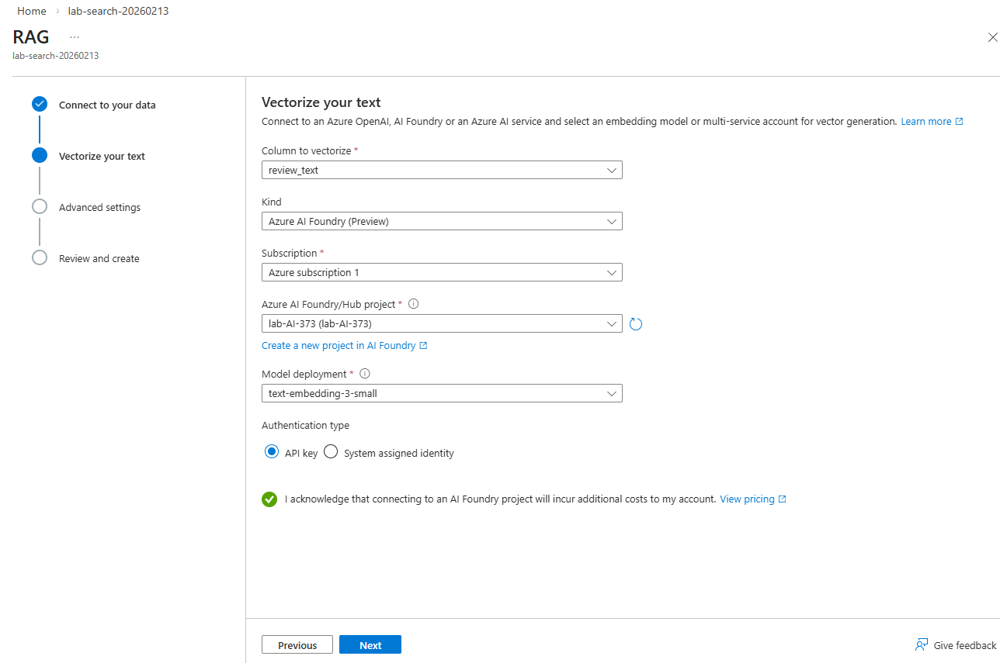
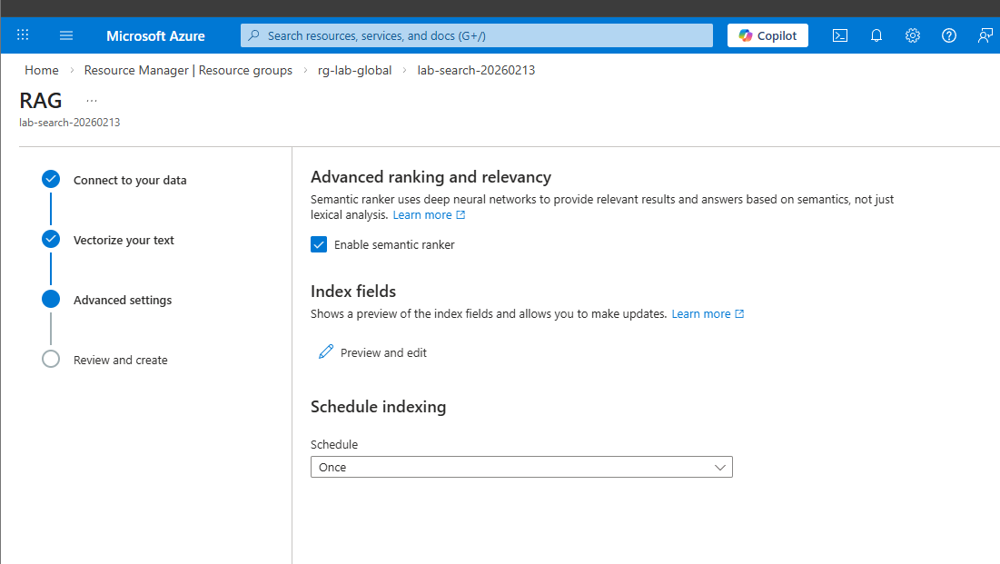
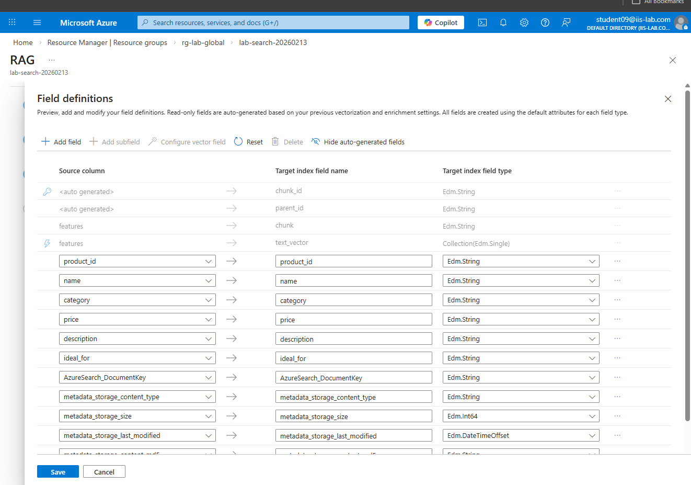
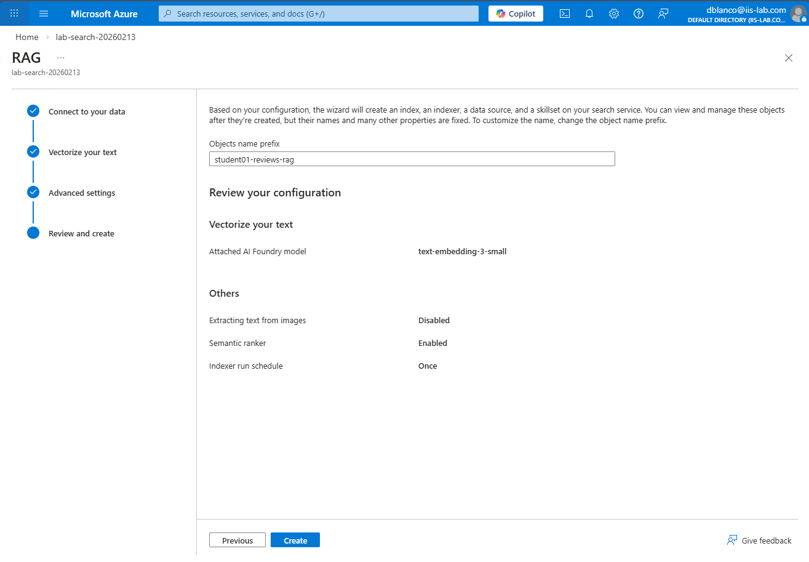
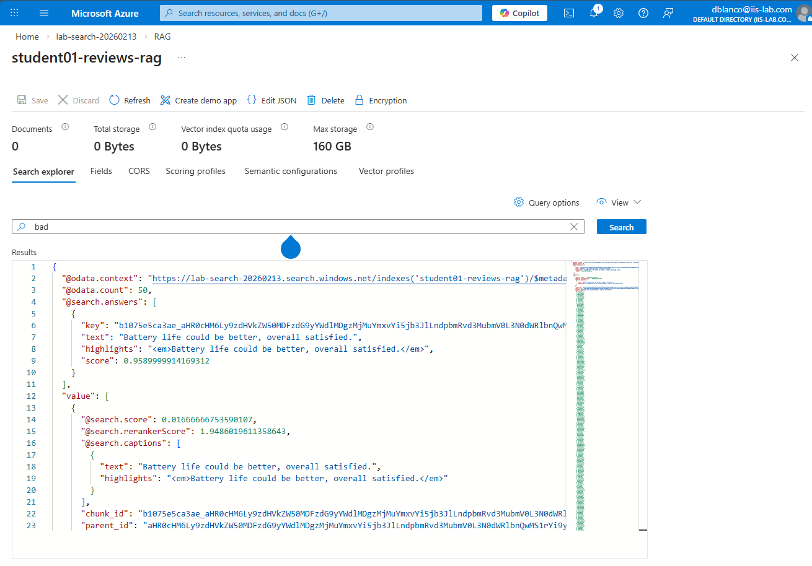

# Lab 1.4 — Retrieval-Augmented Generation (RAG)

In this lab you will connect your uploaded business data to Azure AI Search, creating a searchable index that your AI agent can use to answer questions grounded in real data. This technique is called **Retrieval-Augmented Generation (RAG)** — instead of relying only on what the model learned during training, it retrieves relevant information from your data first and then generates a response based on that information.

### Why RAG?

Without RAG, a language model can only answer based on its training data — which may be outdated, generic, or completely unaware of your organization's information. With RAG:

- The model **searches your data** before answering
- Responses are **grounded in facts** from your documents
- You can **control what the model knows** by choosing which data to index
- **Hallucinations are reduced** because the model cites actual content instead of guessing

---

## Part 1 — Verify Your Data in Blob Storage

Before creating a search index, confirm that your data is uploaded.

1. In the [Azure Portal](https://portal.azure.com), navigate to **your student resource group** (e.g. `rg-student06`).
2. Click on your **Storage Account**.
3. Select **Containers** from the left menu.
4. Open your container (e.g. `student06-kb`) and verify that it has a `reviews/` folder containing `reviews.csv`.

> If the folder or file is missing, create it and upload the file now. Refer back to Lab 1.2 Part 3 for instructions.

---

## Part 2 — Open Azure AI Search

Azure AI Search is a managed search service that can index, vectorize, and query your data. Think of it as a specialized database built for fast, intelligent retrieval.

1. Navigate to **Resource groups** and open **rg-lab-global** (the shared resource group).
2. Find the **Search service** resource and click on it.
3. Click **Import data (new)** as shown below.

4. When prompted for a data source, select **Blob Storage**.

---

## Part 3 — Configure the Data Source

1. Select **RAG** as the import method.

2. Since our data is in CSV format, select **Delimited text** as the parsing mode.

3. Configure the following settings to point to your data:
   - **Resource group:** your student resource group (e.g. `rg-student06`)
   - **Storage account:** your student storage account
   - **Container:** your container (e.g. `student06-kb`)
   - **Folder:** select the `reviews` folder as shown in the image below. If you did  not use a folder, then leave it blank.
   - **Header row:** ✅ Check this box — our CSV files have headers

---

## Part 4 — Vectorize Your Data

On the vectorization page, you will configure how Azure AI Search converts your text data into **vectors** — numerical representations that capture the meaning of the text.

### What is Vectorization?

Traditional search works by matching keywords — if you search for "bad customer service," it looks for those exact words. But what if your data says "terrible support experience"? A keyword search would miss it.

**Vectorization** solves this by converting text into high-dimensional numerical arrays (vectors) where similar meanings are close together in mathematical space. This enables **semantic search** — the search engine understands meaning, not just words.

For example:
- "The product broke after one week" and "Item failed within days" are **different words** but **similar vectors**
- The search engine knows these are related even though they share no keywords

Configure the vectorization settings:
1. Set **Kind** to **Foundry**
2. Set the **Column** to the text field you want to vectorize (e.g. `review_text`)
3. Match your settings to the image below

---

## Part 5 — Preview and Verify Field Definitions

1. Under **Advanced Settings**, make sure **Semantic ranker** is enabled and keep **Scheduled Indexing** set to once (you would enable recurring indexing in a real workflow with frequent data updates).

2. Click **Preview and Edit** to verify that the vectorization correctly identified your data fields.

Each field in your index has configuration options that control how it can be used:

| Option | What it means |
|---|---|
| **Retrievable** | The field's value can be returned in search results |
| **Filterable** | You can filter results by this field (e.g. "show only 5-star reviews") |
| **Sortable** | Results can be sorted by this field |
| **Facetable** | Enables grouping/counting (e.g. "how many reviews per rating") |
| **Searchable** | The field is included in full-text and vector search queries |

Verify that your text fields (like reviews or product descriptions) are marked as **Searchable** and **Retrievable** — these are the fields your AI agent will search and read from.

---

## Part 6 — Name and Submit Your Index

1. Before submitting, **update the index name** to include your student number (e.g. `student06-reviews-index`). This ensures your index doesn't conflict with other students.

2. Click **Submit** to start the indexing process. Azure AI Search will:
   - Read your CSV files from blob storage
   - Parse the delimited data into individual records
   - Vectorize the text fields using the AI model
   - Store everything in a searchable index

This process takes a few minutes depending on the size of your data.

---

## Part 7 — Search Your Index

Once indexing is complete, you can query your data directly from the Azure AI Search interface.

### What is the search index?

The search index is **not a traditional database** — it is a purpose-built data structure optimized for fast retrieval. Think of it like the index at the back of a textbook: instead of reading every page to find what you need, you look up the topic in the index and go directly to the right page.

Your search index stores:
- The **original text** from your CSV files (so it can return the actual content)
- **Vector embeddings** of that text (so it can find semantically similar content)
- **Metadata** about each field (so it can filter, sort, and facet)

When you run a search query:
1. Your query text is **vectorized** using the same model that indexed the data
2. The search engine finds records whose vectors are **closest** to your query vector
3. Results are **ranked by relevance** — the most semantically similar content appears first
4. The original text is **returned** so you (or your AI agent) can read it

**Try it:** In the search explorer, try queries like:
- `bad customer experience`
- `product quality issues`
- `shipping problems`

Notice that results appear even when the exact words don't match — this is semantic search powered by vectorization.

### How Your AI Agent Uses This

When you connect this search index to your Foundry agent (in a later lab), the flow works like this:

1. A user asks your agent a question (e.g. *"What are customers saying about delivery times?"*)
2. The agent **searches your index** using the question as a query
3. The index returns the most relevant records from your data
4. The agent reads those records and **generates a response grounded in your actual data**
5. The response includes information from your documents — not hallucinated content

This is RAG in action: **Retrieve** relevant data, then **Generate** an informed response.

---

## Part 8 — Connect Your Search Index to Your Agent

Now that your index is built, it's time to connect it to your AI agent so it can actually use the data.

1. Go to [Azure AI Foundry](https://ai.azure.com) and open your agent.
2. In the agent configuration pane, find the **Knowledge** section.
3. Click **Add knowledge source**.
4. Select **Azure AI Search** as the source type.
5. When prompted for a connection, select the **azure-search** connection from the dropdown.
6. Select the index you created earlier (e.g. `student06-reviews-index`).
7. Save your changes.

Your agent now has access to your search index. When it receives a question, it will search your index for relevant data before generating a response — this is the RAG pattern in action.

---

## Part 9 — Update Your Agent's Instructions

Connecting the knowledge source is only half the job — your agent also needs to **know how to use it**. This is where the agent's **instructions** (system prompt) come in.

A good instruction makes a good agent. Without clear instructions, the agent may ignore the knowledge source, hallucinate answers, or respond in ways that don't match your use case. The instructions tell the agent who it is, what data it has, and how it should behave.

1. In your agent's configuration, find the **Instructions** field.
2. Update the instructions to tell the agent about its knowledge source and how to use it. For example:

   > You are a helpful customer insights assistant. You have access to a knowledge base containing product reviews and product information. When a user asks a question about products, reviews, customer feedback, or ratings, **always search your knowledge base first** and base your answer on the data you find. If the knowledge base does not contain relevant information, say so honestly rather than guessing. Cite specific details from the data when possible.

3. Save your changes.

### Tips for Writing Good Agent Instructions

- **Be specific** — Tell the agent exactly what kind of data it has and what topics it should answer questions about.
- **Set boundaries** — Tell the agent what to do when it *doesn't* find relevant data (e.g. "say you don't have that information" rather than letting it hallucinate).
- **Define the persona** — Give the agent a role (e.g. "customer insights assistant") so its tone and focus stay consistent.
- **Reinforce grounding** — Explicitly tell the agent to search its knowledge base before answering. Don't assume it will do this on its own.

Try asking your agent questions about the data, such as:
- *"What are customers saying about product quality?"*
- *"Are there any common complaints in the reviews?"*
- *"Summarize the overall customer sentiment."*

Compare the responses to what you saw when querying the search index directly in Part 7. The agent should now give answers grounded in your actual data.

---

## Reflection

- What happens if you search for something that isn't in your data? How does the agent handle it with RAG vs. without?
- Why is semantic search better than keyword search for AI-powered applications?
- If your index contains sensitive customer data, who can query it? How would you restrict access?
- Could an attacker craft a prompt that causes the agent to dump the entire contents of the search index?

---

## Summary

In this lab you:

1. Verified your business data in blob storage
2. Created a search index using Azure AI Search's RAG import pipeline
3. Configured CSV parsing with headers and delimiters
4. Vectorized your text data — converting words into numerical representations for semantic search
5. Reviewed field definitions and understood retrievable, filterable, sortable, and searchable options
6. Submitted and built your search index
7. Queried the index and saw semantic search in action
8. Connected your search index to your Foundry agent as a knowledge source
9. Updated your agent's instructions to leverage the knowledge base — because a good instruction makes a good agent

Your agent is now powered by RAG — it searches your real business data before answering, reducing hallucinations and grounding every response in facts. In upcoming labs, you will explore what happens when AI meets real business data and how to secure this pipeline.

